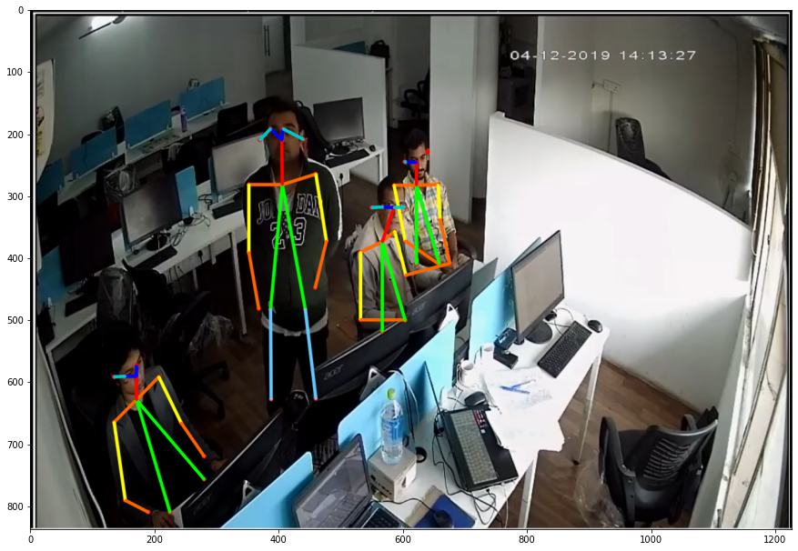
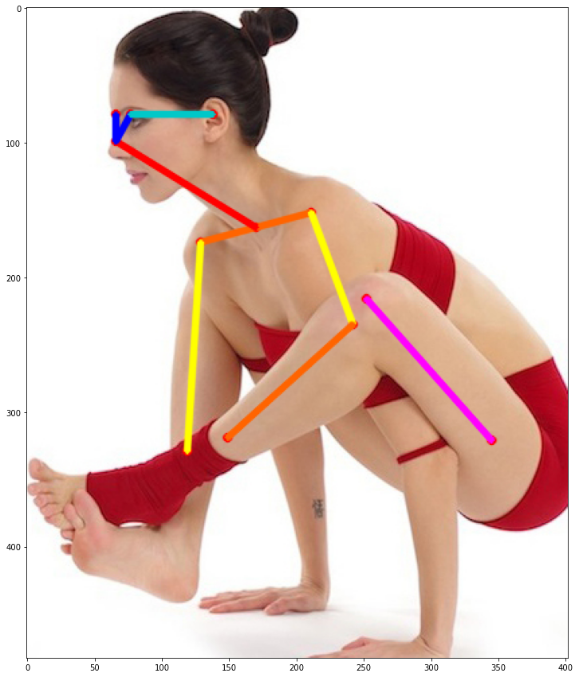

## Pose-Estimation using OpenPose
	* multi-person-openpose
	* Yoga_Pose_Classifier
Here we have two project, one is multi person openpose in which we have used openpose to find pose on the human body. In another project, We have Model to classify yoga pose type and estimate joint positions of a person from an image.

Basic concepts of pose estimation are, 
### Pose Output Format (BODY_25)

    

### Pose Output Format (COCO)

    

### Face Output Format

    

### Hand Output Format

    

### Pose Estimation output

    

### Yoga Pose Estimation

    

#### Dependencies

- Openpose
- Tensorflow
- Pytorch
- OpenCV

#### author

- Kunal Bhashkar
- bhashkar.brand@gmail.com